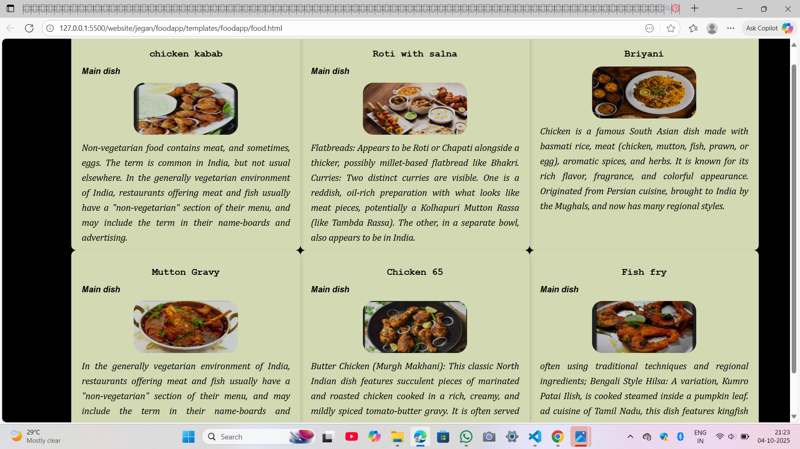
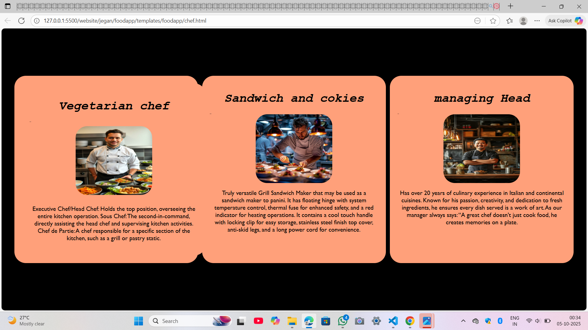
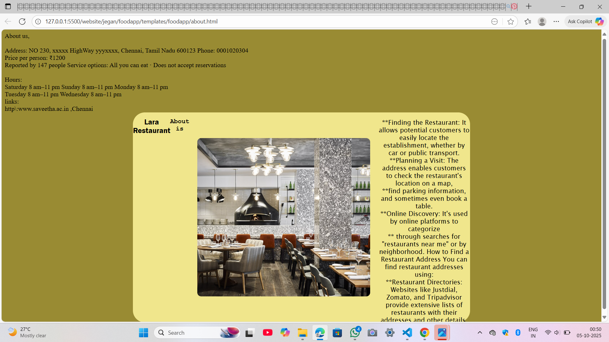

# Ex.07 Restaurant Website
# Date:05/10/2025
# AIM:
To develop a static Restaurant website to display the food items and services provided by them.

# DESIGN STEPS:
## Step 1:
Requirement collection.

## Step 2:
Creating the layout using HTML and CSS.

## Step 3:
Updating the sample content.

## Step 4:
Choose the appropriate style and color scheme.

## Step 5:
Validate the layout in various browsers.

## Step 6:
Validate the HTML code.

## Step 7:
Publish the website in the given URL.

# PROGRAM:
```
Dishes:


<html>
<!DOCTYPE html>
<html lang="en">
<head>
    <meta charset="UTF-8">
    <meta name="viewport" content="width=device-width, initial-scale=1.0">
    <title>Document</title>
<style>
    body{
        margin:0;
        padding:0;
    }
        .cover h1{
            text-align: center;
            font-size: large;
            font-family: 'Courier New';
            font-weight: 200px;

        }
        body{
            font-family: 'Arial Narrow Bold', sans-serif;
            font-size: medium;
            padding: 20px;
            background-color: black;
            
        }
        .cover-card {
            width: 400px;
            height: 380px;
            background-color: #d2d9b3;
            box-shadow: 0 4px 8px rgba(0,0,0,0.2);
            display: flex;
            flex-direction:column;
            align-items: center;
            padding: 20px;
            border-radius: 10px;
            margin:center;
            float:right;
            flex-wrap:wrap;
        }
        .cover menu{
            text-align: center;
            padding: 20px;
        }
        .cover.hover{
            transform: scale(2.0);
        }

        .cover h2{
            text-align: left;
            font-size: medium;
            font-style: italic;
            font-weight: 90px;

       
        }
        .cover img{
            border-radius: 20px;
            display: block;
            width:200px;
            height:100px;
            margin:auto;

        }
        .cover p{
            font-style:oblique;
            font-size: medium;
            text-align: justify;
            line-height:1.6;
            font-size: 18px;
            margin:10px 0;
            font-family:Cambria, Cochin, Georgia, Times, 'Times New Roman', serif;
        }

    </style>
    </head>
    <body style="background:linear-gradient(to left black);">
        <div class="cover menu">
      <!-- first content --> -->
        <div class="cover-card">
        <div style="background:linear-gradient(to left black);"><h1>Briyani</h1>
        <h2 Main dish></h2>
        
        <p>Chicken is a famous South Asian dish 
       made with basmati rice, meat 
       (chicken, mutton, fish, prawn, or egg), aromatic spices, and herbs.
       It is known for its rich flavor, fragrance, and colorful appearance.
       Originated from Persian cuisine, brought to India by the Mughals, 
       and now has many regional styles.
</div>
</div>
<!-- second content -->
    <div class="cover-card">
      <div class="cover"><h1>Roti with salna</h1>
      <h2>Main dish</h2>
      
      <p>Flatbreads: Appears to be Roti or Chapati alongside a thicker, possibly millet-based flatbread like Bhakri.
Curries: Two distinct curries are visible. One is a reddish, oil-rich preparation with what looks like meat pieces, potentially a Kolhapuri Mutton Rassa (like Tambda Rassa). The other, in a separate bowl, also appears to be in India.
</p>
</div>
</div>
<!-- Third content -->
    <div class="cover-card">
      <div class="cover"><h1>chicken kabab</h1>
      <h2>Main dish</h2>
      
      <p>Non-vegetarian food contains meat, and sometimes, eggs. The term is common in India, but not usual elsewhere. 
        In the generally vegetarian environment of India, restaurants offering meat and fish usually have a "non-vegetarian" section of their menu, 
        and may include the term in their name-boards and advertising.

      </p>
  </div>
 </div>
 <!-- fouth content --> -->
   <div class="cover-card">
        <div><h1>Fish fry</h1>
        <h2>Main dish</h2>
        
        <p>often using traditional techniques and regional ingredients;
      Bengali Style Hilsa: 
      A variation, Kumro Patai Ilish, is cooked steamed inside a pumpkin leaf.
      ad cuisine of Tamil Nadu, this dish features kingfish (Surmai) marinated in fiery spices and fried until crispy.

        </p>
    </div>
    </div>
    <!-- fifth content -->
      <div class="cover-card">
        <div><h1>Chicken 65</h1>
        <h2>Main dish</h2>
        
        <p>Butter Chicken (Murgh Makhani): This classic North Indian dish features succulent pieces of marinated and roasted chicken cooked in a rich, creamy, and mildly spiced tomato-butter gravy. It is often served with naan or rice. 
Chicken Chettinad: A fiery and fragrant dish from the Chettinad region of South India.

        </p>
        </div>
        </div>
        <!-- fifth content -->
        <div class="cover-card">
      <div class="cover"><h1>Mutton Gravy</h1>
      <h2>Main dish</h2>
      
      <p>In the generally vegetarian environment of India, restaurants offering meat and fish usually have a "non-vegetarian" section of their menu, 
        and may include the term in their name-boards and advertising.
      </p>
</div>
</div>
</body>

</html>


chefs:

<html>
    <head>
        <title align="center" bgcolor="white">Proferser or chefs</title>
        <style>
            .conatainer title{
                text-align: center;
                font-family: 'Courier New', Courier, monospace;
                font-size: 200px;

            }
            body{
                background-color: black;
                padding:20px;
                display:flex;
                float:calc(1);
            }
            .container{
                font-family: Cambria, Cochin, Georgia, Times, 'Times New Roman', serif;
                margin: auto;
                display:flex;
                float:left;
                font-size: medium;
                background-color:lightsalmon;
                border-radius: 30px;
                padding:20px;
                flex-direction:column;
                width:440px;
                height:450px;
                flex-wrap:wrap;

            }
            .container.hover{
                transform:scale(2.0)
            }
            .container h1{
                font-family: 'Courier New', Courier, monospace;
                font-weight: px;
                font-style: oblique;
                text-align: center;
            }
            .container h2{
                font-family:'Gill Sans', 'Gill Sans MT', Calibri, 'Trebuchet MS', sans-serif;
                font-weight: px;
                font-style: oblique;
                text-align: left;
                font-size: 1px;
            }
            .container img{
                border-radius:30px;
                margin:auto;
                display:block;
                width:200px;
                height:180px;
            }
            .container p{
                font-family:'Gill Sans', 'Gill Sans MT', Calibri, 'Trebuchet MS', sans-serif;
                font-size: medium;
                text-align:center;


            }
            .container chef{
                text-align: center;
                padding:20px;

            }
            .container menu{
                text-align: center;
                padding: 20px;
            }
        </style>
    </head>
    <body contatainer title:text-align="center">
        <div class="container menu">
            <!-- first chef -->
        <div class="container">
         <h1>Vegetarian chef</h1>
                <h2>Mr.singh</h2>
                
                <p>Executive Chef/Head Chef: Holds the top position, overseeing the entire kitchen operation. 
                  Sous Chef: The second-in-command, directly assisting the head chef and supervising kitchen activities. 
                  Chef de Partie: A chef responsible for a specific section of the kitchen, such as a grill or pastry static.
      
</p></div>
</div>
       <div class="container">
        <div style="background:linear-gradient(to left black);"><h1>Sandwich and cokies</h1>
                <h2>Mr.pflim</h2>
                
                <p>
                    Truly versatile Grill Sandwich Maker that may be used as a sandwich maker to panini.
It has floating hinge with system temperature control, thermal fuse for enhanced safety, and a red indicator for heating operations.
It contains a cool touch handle with locking clip for easy storage, stainless steel finish top cover, anti-skid legs, and a long power cord for convenience.
                </p>
      
</div>
</div>
        <div class="container">
        <div style="background:linear-gradient(to left black);"><h1>managing Head</h1>
                <h2>Mr.Alen</h2>
                
                <p>
                    Has over 20 years of culinary experience in 
      Italian and continental cuisines. Known for his passion, creativity, and 
      dedication to fresh ingredients, he ensures every dish served is a work of art. 
      As our manager always says: “A great chef doesn't just cook food, 
      he creates memories on a plate. 
    </p>
                </p>
</div>
</div>
         
    </body>
</html>

About Restaurant:

<!DOCTYPE html>
<html>
    <head>
        <style>
            body{
                background-color: rgb(153, 139, 51);
            }
            .container{
                font-size: medium;
                display:flex;
                float:center;
                background-color: khaki;
                margin:auto;
                width:850px;
                height:530px;
                border-radius: 30px;
                font-family: 'Courier New', Courier, monospace;

            }
            .container h1{
                font-size: larger;
                font-family: 'Franklin Gothic Medium', 'Arial Narrow', Arial, sans-serif;
                font-weight: 150px;
                text-align: center;
            }
            .container h2{
                font-family: 'Courier New', Courier, monospace;
                font-size: medium;
                text-align: center;
            }
            .container img{
                border-radius:30px;
                width:500px;
                height:400px;
                padding:20px;
                display:flex;
                margin:auto;
                
            }
            .container menu{
                text-align: center;
                padding: 20px;
            }
            .container p{
                text-align: center;
                font-family:'Lucida Sans', 'Lucida Sans Regular', 'Lucida Grande', 'Lucida Sans Unicode', Geneva, Verdana, sans-serif;
                font-weight: medium;

            }
            .container p1{
                text-align: left;
                font-family:'Segoe UI', Tahoma, Geneva, Verdana, sans-serif;
                font-size: medium;
                font-weight: 100px;

            }

        </style>

    </head>
    <body>
           <h>About us,</h><br><p1 font-size="medium">
<br>Address: NO 230, xxxxx HighWay yyyxxxx, Chennai, Tamil Nadu 600123
Phone: 0001020304
<br>Price per person: ₹1200
<br>Reported by 147 people
Service options: All you can eat · Does not accept reservations</br>
<br>Hours: <br>
Saturday	8 am–11 pm
Sunday	8 am–11 pm
Monday	8 am–11 pm
<br>Tuesday	8 am–11 pm
Wednesday	8 am–11 pm
<br>links:<br>
http\:www.saveetha.ac.in ,Chennai
<body>
    <div class="container menu">
        <!-- first content -->
            <h1 align="center">Lara Restaurant</h1>
            <h2 align="center">About is</h2>
            
            <p align="down">
            **Finding the Restaurant: It allows potential customers to easily locate the establishment, whether by car or public transport. 
<br>**Planning a Visit: The address enables customers to check the restaurant's location on a map, 
<br>**find parking information, and sometimes even book a table. 
<br>**Online Discovery: It's used by online platforms to categorize
<br>** through searches for "restaurants near me" or by neighborhood. 
How to Find a Restaurant Address You can find restaurant addresses using:
<br>**Restaurant Directories: Websites like Justdial, Zomato, and Tripadvisor provide extensive lists of restaurants with their addresses and other details. 
            </p>
         
    </div>
</body>
```
# OUTPUT:



# RESULT:
The program for designing software company website using HTML and CSS is completed successfully.
